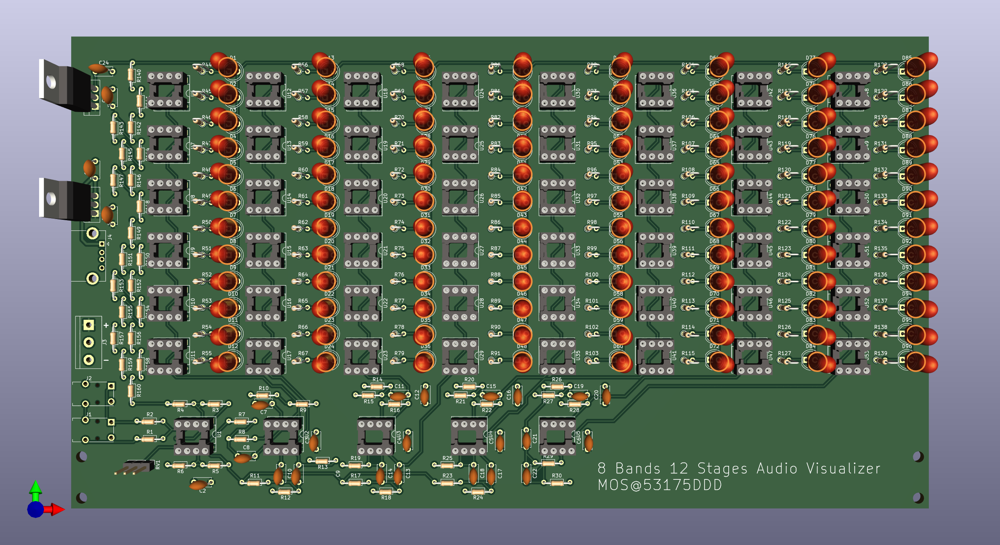

# AudioVisualizer

8 バンド 12 ステージオーディオビジュアライザ

# 回路図

# 基板

# 部品表

| 部品番号 | 部品名 | リンク |
|:----|:----|:----|
| C1 ~ C8, C21, C22, C24, C25 | 0.1uF | <https://akizukidenshi.com/catalog/g/gP-10147/> |
| C9, C11, C18 | 0.068uF | <https://akizukidenshi.com/catalog/g/gP-08143/> |
| C10, C12 | 0.47uF | <https://akizukidenshi.com/catalog/g/gP-08148/> |
| C13 | 0.033uF | <https://akizukidenshi.com/catalog/g/gP-08141/> |
| C14 | 0.22uF | <https://akizukidenshi.com/catalog/g/gP-08146/> |
| C15 | 0.022uF | <https://akizukidenshi.com/catalog/g/gP-08140/> |
| C16 | 0.15uF | <https://akizukidenshi.com/catalog/g/gP-08145/> |
| C17, C19, C20 | 0.01uF | <https://akizukidenshi.com/catalog/g/gP-08138/> |
| C23 | 0.047uF | <https://akizukidenshi.com/catalog/g/gP-08142/> |
| D1 ~ D96 | 5mm LED | 例：<https://akizukidenshi.com/catalog/g/gI-01322/> 抵抗内蔵でない単色 LED なら何色でも可 |
| J1, J2 | 3.5mm Audio Jack | <https://akizukidenshi.com/catalog/g/gC-02460/> |
| J3 | 3P ターミナル | <https://akizukidenshi.com/catalog/g/gP-01307/> |
| J4 | USB A レセプタクル | <https://akizukidenshi.com/catalog/g/gC-00160/> |
| R1, R2, R4 ~ R6, R144 | 1kΩ | <https://akizukidenshi.com/catalog/g/gR-25102/> |
| R3, R16, R17, R20, R21, R141 | 4.7kΩ | <https://akizukidenshi.com/catalog/g/gR-25472/> |
| R7 | 9.1kΩ | <https://akizukidenshi.com/catalog/g/gR-25912/> |
| R8 | 27kΩ | <https://akizukidenshi.com/catalog/g/gR-25273/> |
| R9 | 33kΩ | <https://akizukidenshi.com/catalog/g/gR-25333/> |
| R10 | 56kΩ | <https://akizukidenshi.com/catalog/g/gR-14279/> |
| R11, R12, R25 | 6.8kΩ | <https://akizukidenshi.com/catalog/g/gR-25682/> |
| R13 | 8.2kΩ | <https://akizukidenshi.com/catalog/g/gR-25822/> |
| R14, R15 | 3.9kΩ | <https://akizukidenshi.com/catalog/g/gR-25392/> |
| R18, R19, R23, R28 | 5.6kΩ | <https://akizukidenshi.com/catalog/g/gR-25562/> |
| R22, R26, R27 | 5.1kΩ | <https://akizukidenshi.com/catalog/g/gR-07832/> |
| R24 | 6.2kΩ | <https://akizukidenshi.com/catalog/g/gR-14278/> |
| R29, R30, R147, R150, R151 | 330Ω | <https://akizukidenshi.com/catalog/g/gR-25331/> |
| R44 ~ R139 | 510Ω 1/6W | <https://akizukidenshi.com/catalog/g/gR-25511/> |
| R140 | 51kΩ | <https://akizukidenshi.com/catalog/g/gR-25513/> |
| R142 | 2.2kΩ | <https://akizukidenshi.com/catalog/g/gR-25222/> |
| R143, R145, R146 | 510Ω 1.4W | <https://akizukidenshi.com/catalog/g/gR-25511/> |
| R148 | 470Ω | <https://akizukidenshi.com/catalog/g/gR-25471/> |
| R149 | 220Ω | <https://akizukidenshi.com/catalog/g/gR-25221/> |
| R152 | 75Ω | <https://akizukidenshi.com/catalog/g/gR-25750/> |
| R153, R157 ~ R160 | 10Ω | <https://akizukidenshi.com/catalog/g/gR-25100/> |
| R154 ~ R156 | 27Ω | <https://akizukidenshi.com/catalog/g/gR-14273/> |
| RV1 | 10kΩ B カーブ | <https://akizukidenshi.com/catalog/g/gP-08012/> |
| U1 ~ U5 | LM2904 | <https://akizukidenshi.com/catalog/g/gI-13643/> |
| U6 ~ U53 | LM393 | <https://akizukidenshi.com/catalog/g/gI-16987/> |
| U54, U55 | NJM7805 | <https://akizukidenshi.com/catalog/g/gI-08678/> |

※1：R31 ~ R43 は欠番です
※2：入力に対し感度が強すぎる場合，R6 を取り外して使用してください
