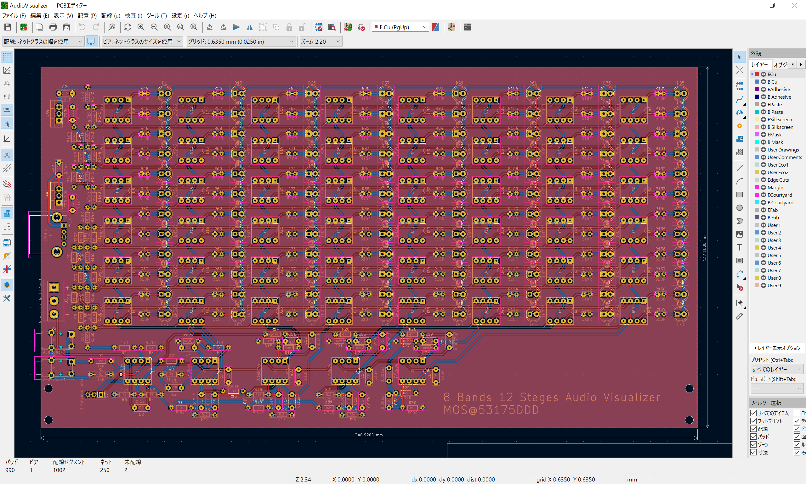

# AudioVisualizer

8 バンド 12 ステージオーディオビジュアライザ

# 回路図

# 基板

# 部品表

| 部品番号 | 部品名 | リンク |
|:----|:----|:----|
| C1 - C6, C23 - C26 | 0.1uF | <https://akizukidenshi.com/catalog/g/gP-10147/> |
| C7, C16, C18 | 0.0068uF | <https://wakamatsu.co.jp/biz/products/detail.php?product_id=21280110> |
| C8, C9 | 1uF | <https://akizukidenshi.com/catalog/g/gP-08150/> |
| C10 | 0.47uF | <https://akizukidenshi.com/catalog/g/gP-08148/> |
| C11 | 0.68uF | <https://akizukidenshi.com/catalog/g/gP-08149/> |
| C12 | 0.033uF | <https://akizukidenshi.com/catalog/g/gP-08141/> |
| C13 | 0.33uF | <https://akizukidenshi.com/catalog/g/gP-08147/> |
| C14 | 0.015uF | <https://akizukidenshi.com/catalog/g/gP-08139/> |
| C17 | 0.15uF | <https://akizukidenshi.com/catalog/g/gP-08145/> |
| C19 | 0.068uF | <https://akizukidenshi.com/catalog/g/gP-08143/> |
| C20 | 0.0033uF | <https://akizukidenshi.com/catalog/g/gP-03228/> |
| C21, C22 | 0.001uF | <https://akizukidenshi.com/catalog/g/gP-07673/> |
| D1 ~ D96 | 5mm LED | 例：<https://akizukidenshi.com/catalog/g/gI-01322/> 抵抗内蔵でない単色 LED なら何色でも可 |
| J1, J2 | 3.5mm Audio Jack | <https://akizukidenshi.com/catalog/g/gC-02460/> |
| J3 | 3P ターミナル | <https://akizukidenshi.com/catalog/g/gP-01307/> |
| J4 | USB A レセプタクル | <https://akizukidenshi.com/catalog/g/gC-00160/> |
| R1, R2, R4 - R6, R144 | 1kΩ | <https://akizukidenshi.com/catalog/g/gR-25102/> |
| R3, R23, R141 | 4.7kΩ | <https://akizukidenshi.com/catalog/g/gR-25472/> |
| R7 | 22kΩ | <https://akizukidenshi.com/catalog/g/gR-25223/> |
| R8 | 15kΩ | <https://akizukidenshi.com/catalog/g/gR-25153/> |
| R11, R17, R20 | 5.6kΩ | <https://akizukidenshi.com/catalog/g/gR-25562/> |
| R12, R18, R21, R27 | 150Ω | <https://akizukidenshi.com/catalog/g/gR-25151/> |
| R13, R19, R28 | 150kΩ | <https://akizukidenshi.com/catalog/g/gR-07855/> |
| R14 | 5.1kΩ | <https://akizukidenshi.com/catalog/g/gR-25153/> |
| R15 | 130Ω | <https://akizukidenshi.com/catalog/g/gR-09123/> |
| R16, R25 | 100kΩ | <https://akizukidenshi.com/catalog/g/gR-25104/> |
| R22 | 180kΩ | <https://akizukidenshi.com/catalog/g/gR-25184/> |
| R24 | 120Ω | <https://akizukidenshi.com/catalog/g/gR-25121/> |
| R26 | 6.2kΩ | <https://akizukidenshi.com/catalog/g/gR-14278/> |
| R29 | 2.7kΩ | <https://akizukidenshi.com/catalog/g/gR-25272/> |
| R30 | 390Ω | <https://akizukidenshi.com/catalog/g/gR-25391/> |
| R44 - R139 | 510Ω 1/6W | <https://akizukidenshi.com/catalog/g/gR-08533/> |
| R410 | 51kΩ | <https://akizukidenshi.com/catalog/g/gR-07850/> |
| R142 | 2.2kΩ | <https://akizukidenshi.com/catalog/g/gR-25222/> |
| R143, R145, R146 | 510Ω 1/4W | <https://akizukidenshi.com/catalog/g/gR-25511/> |
| R147, R150, R151 | 330Ω | <https://akizukidenshi.com/catalog/g/gR-25331/> |
| R148 | 470Ω | <https://akizukidenshi.com/catalog/g/gR-25471/> |
| R149 | 220Ω | <https://akizukidenshi.com/catalog/g/gR-25221/> |
| R152 | 75Ω | <https://akizukidenshi.com/catalog/g/gR-25750/> |
| R153, R157 - R160 | 10Ω | <https://akizukidenshi.com/catalog/g/gR-25100/> |
| R154 - R156 | 27Ω | <https://akizukidenshi.com/catalog/g/gR-07960/> |
| RV1 | 10kΩ B カーブ | <https://akizukidenshi.com/catalog/g/gP-08012/> |
| U1 ~ U5 | LM2904 | <https://akizukidenshi.com/catalog/g/gI-13643/> |
| U6 ~ U53 | LM393 | <https://akizukidenshi.com/catalog/g/gI-16987/> |
| U54, U55 | NJM7805 | <https://akizukidenshi.com/catalog/g/gI-08678/> |

※1：部品番号に一部欠番があります
※2：入力に対し感度が強すぎる場合，R6 を取り外して使用してください
※3：基本的に秋月で部品が揃うようにしていますが，取り扱いがない場合は別の販売元のリンクで代用しています
